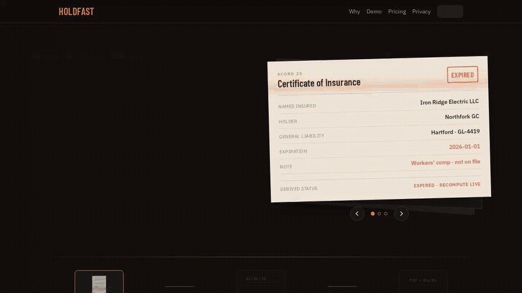
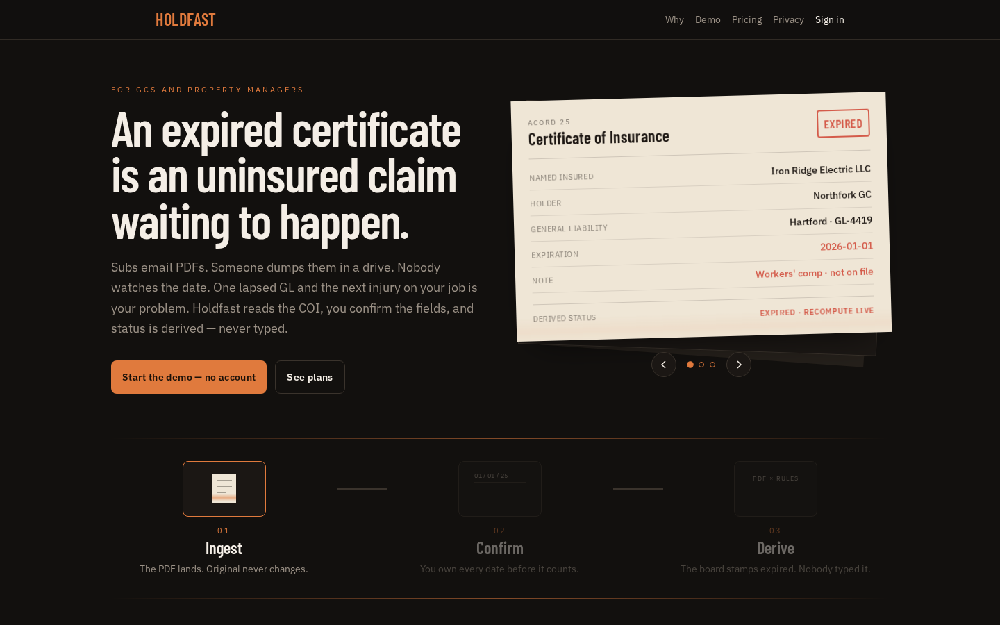
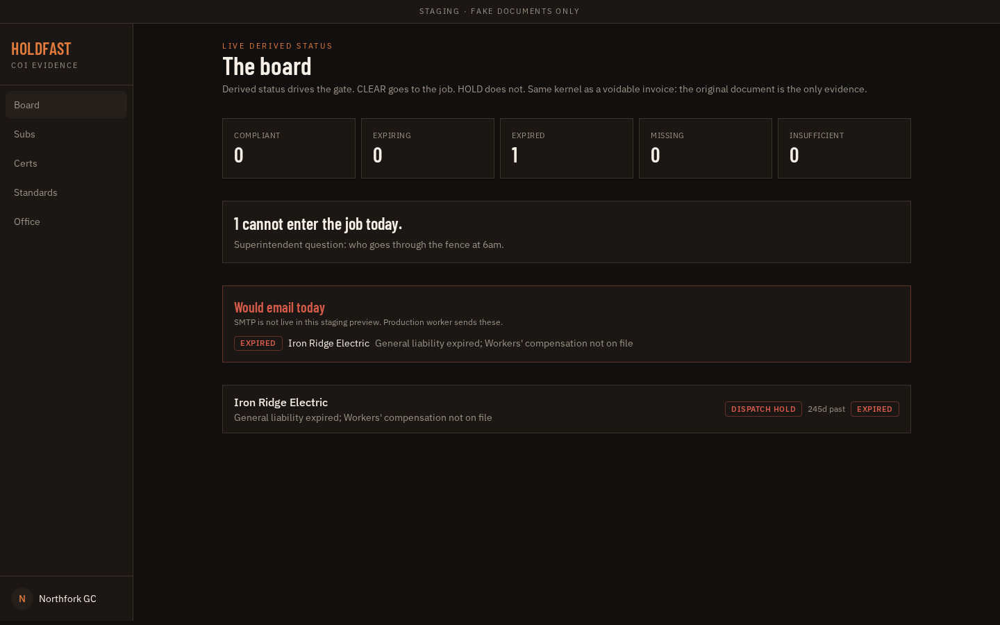

# Holdfast

Certificates of insurance for GCs. **Status is derived, never typed.**

Subs email ACORDs. Someone used to dump them in a drive and check a box. Holdfast reads the PDF, a human confirms the dates, and the board says **CLEAR / WATCH / HOLD**. HOLD does not go through the fence.



| Landing | The board |
| --- | --- |
|  |  |

```bash
npm install
npm run dev    # http://localhost:8080
```

Fake documents only in staging. Confirm is mandatory — OCR is a draft, not a verdict.
